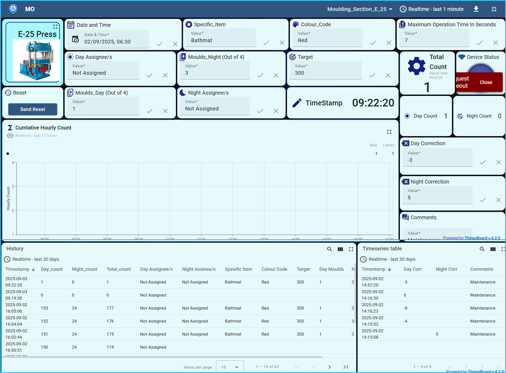
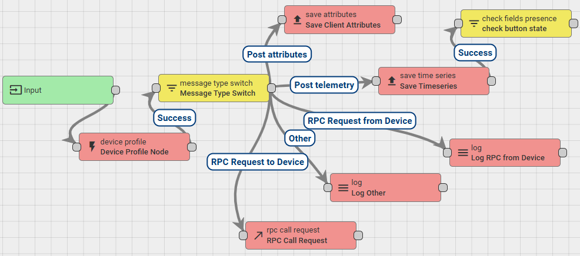
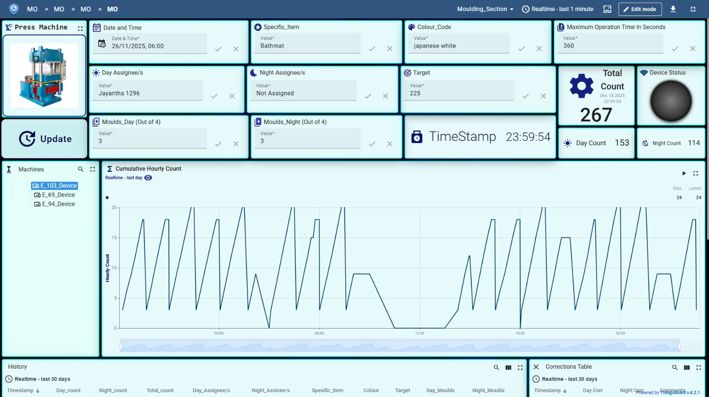
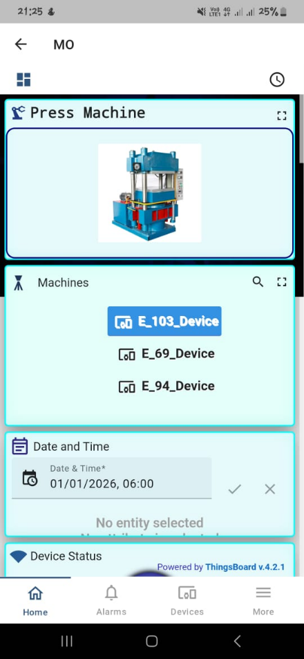
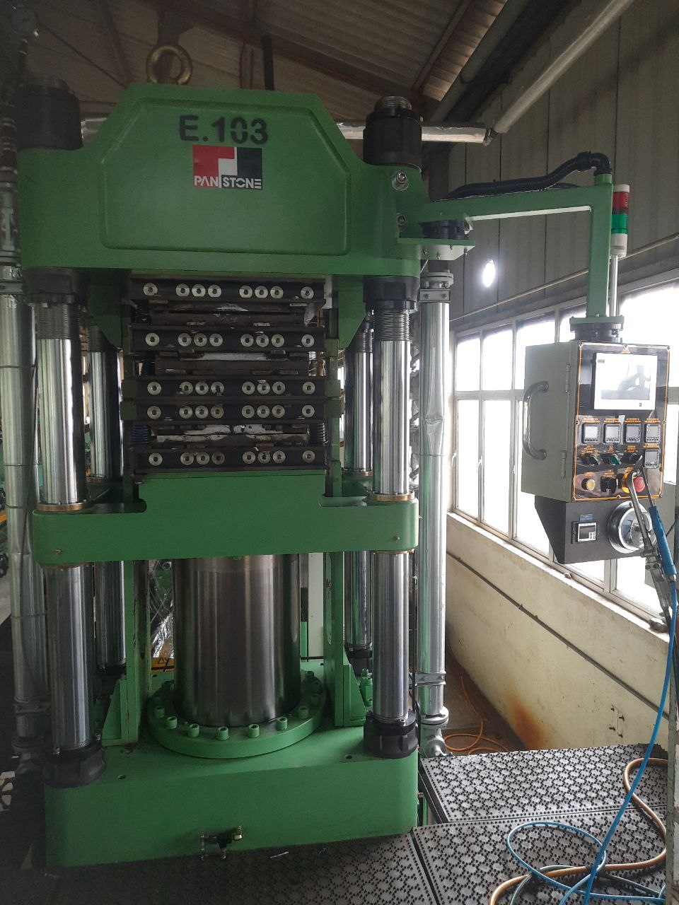
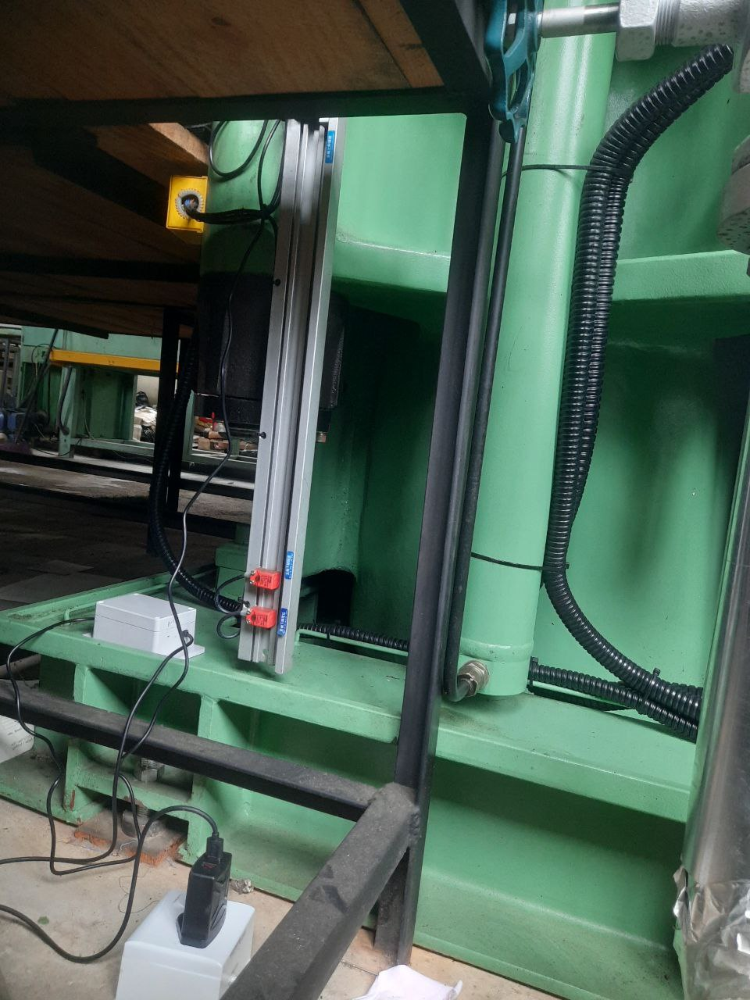
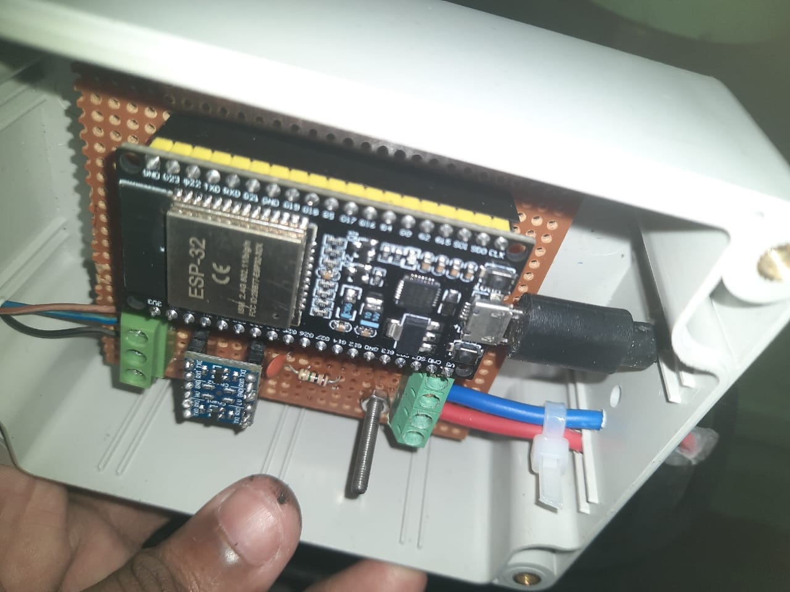
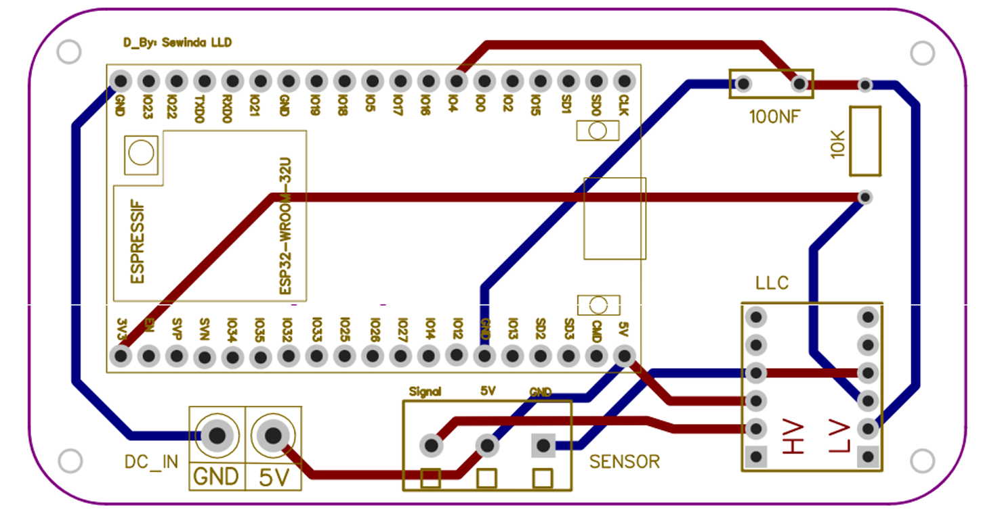
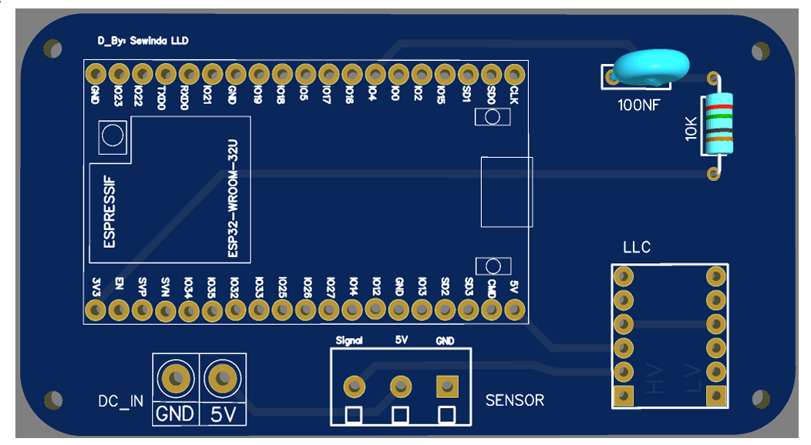

# E-25 / E-103 Press Machine — Networked IoT Production Monitor

A wireless telemetry and remote-control system built for Samson International PLC's moulding-section press machines: ESP32 edge devices publish production data over MQTT to a ThingsBoard cloud dashboard (web + mobile), replacing manual paper-based counting with real-time, remotely configurable monitoring.

Built during my second industrial training placement (04 Aug 2025 – 26 Oct 2025) at Samson International PLC, Bogahagoda, Galle, Moulding Section (supervised by Mr. Asanka Edirisinghe, Production Executive). Piloted end-to-end on the **E-25** press, then scaled to **E-69**, **E-103**, and **E-94**.

> **Context:** I'm an Electrical & Information Engineering undergraduate specializing in **Computer Networking, Telecommunications & Security** (Electrical Engineering minor). This project was my hands-on introduction to designing and securing a real device-to-cloud data network — Wi-Fi transport, MQTT pub/sub messaging, remote firmware delivery, and the access-control/authentication trade-offs of a live industrial deployment.


*The pilot dashboard for the E-25 press — the same architecture, later replicated per-device for E-69/E-103/E-94.*

---

## Table of Contents

- [Skills Demonstrated](#skills-demonstrated)
- [Problem & Objective](#problem--objective)
- [Project Scope — From E-25 Pilot to Fleet Rollout](#project-scope--from-e-25-pilot-to-fleet-rollout)
- [Network & System Architecture](#network--system-architecture)
- [Communication Protocol Design](#communication-protocol-design)
- [Security Considerations](#security-considerations)
- [Firmware Logic](#firmware-logic)
- [ThingsBoard Dashboard](#thingsboard-dashboard)
- [Data Model (ESP32 ↔ ThingsBoard)](#data-model-esp32--thingsboard)
- [Hardware](#hardware)
- [Engineering Problems & Solutions](#engineering-problems--solutions)
- [Repository Guide](#repository-guide)
- [Build & Flash](#build--flash)
- [Configuration](#configuration)
- [OTA & Wireless Debugging](#ota--wireless-debugging)
- [Bill of Materials](#bill-of-materials)
- [Related Work: ML Jar-Sealing-Ring Counter](#related-work-ml-jar-sealing-ring-counter)
- [Future Work](#future-work)
- [Documents in this Repo](#documents-in-this-repo)

---

## Skills Demonstrated

| Area | Applied in this project |
|---|---|
| **Computer networking** | Designed the device's TCP/IP + Wi-Fi connectivity, including automatic reconnection handling when Wi-Fi or the MQTT session drops mid-shift, and diagnosed a real EMI/Faraday-cage Wi-Fi dropout issue on the factory floor |
| **Telecommunications / protocol design** | Built the full MQTT pub/sub topic structure (telemetry, shared/client attributes, two-way RPC) between the ESP32 and ThingsBoard; tuned keepalive/socket-timeout and packet-size parameters for a lossy industrial network |
| **Security** | Identified and remediated hardcoded/shared secrets (moved to a gitignored `secrets.h`, de-duplicated the OTA/Wi-Fi password); can articulate the remaining gaps (plaintext MQTT, unencrypted debug channel) and their hardening path — see [Security Considerations](#security-considerations) |
| **Data networks & design** | Designed the attribute/telemetry data model and the ThingsBoard Rule Chain that routes inbound MQTT messages to timeseries storage, attribute storage, or RPC handling based on message type |
| **Embedded systems design** *(minor)* | ESP32 firmware in C++, sensor interfacing (inductive proximity sensors, relay isolation), PCB schematic design in EasyEDA |

## Problem & Objective

The moulding section's press machines (bathmats, mud/floor carpets, road bumpers, flower pots) were tracked with manual tallies and paper job cards:

- No visibility into production for a specific hour — only end-of-shift totals.
- Manual, error-prone daily reporting with no audit trail.
- Decisions made in "Wait & Fix" mode instead of "Predict & Prevent".

**Objective:** design a low-cost network of ESP32 edge devices that count machine cycles locally, publish live counts over MQTT to a ThingsBoard dashboard (web + mobile), and accept remote configuration (active moulds, cycle time, assignees, targets) from that dashboard — without ever re-flashing firmware in the field.

## Project Scope — From E-25 Pilot to Fleet Rollout

1. **Pilot** — E-25 press: minimum viable dashboard + counting logic, proven end-to-end.
2. **Scale/retrofit** — same network architecture adapted to the legacy **E-69** (relay-based signal source) and modern PLC-driven **E-103** / **E-94** (proximity-sensor-based signal source).
3. **Hardware design** — PCB layout and industrial IP enclosures suited to the moulding floor's carbon dust and oil mist.
4. **Dashboard rollout** — per-machine ThingsBoard devices under a shared `moulding_section` entity alias, with customer/user access control for supervisors via ThingsBoard Live (mobile).

This repo's firmware (`src/main.cpp`) is the shared base — originally written for E-103, then adapted back for E-25 (hence the repo name). Machine-specific constants (`TOKEN`, `ATMOST`, `EXCEED_LIMIT`, `BUTTON_PIN`) are the only parts that change between deployments; the networking, validation, and telemetry logic is common to all four machines.

## Network & System Architecture

```
[Machine cycle event]
   │  (relay pulse on E-69/E-25, proximity-sensor edge on E-103/E-94)
   ▼
[Signal conditioning]  → RC low-pass filter + logic level shifter (5V → 3.3V)
   ▼
[ESP32 edge node — GPIO4, INPUT_PULLUP, FALLING-edge detect]
   │  • debounce (200ms) + accidental-press lockout (5s)
   │  • cycle-time window validation, noise rejection, shift detection
   │  • local persistence to NVS (survives power loss / reboot)
   ▼
[Wi-Fi station, WPA2] ── TCP ──▶ [MQTT broker — demo.thingsboard.io:1883]
   │  publish: v1/devices/me/telemetry
   │  subscribe: v1/devices/me/attributes, /attributes/response/+, /rpc/request/+
   ▼
[ThingsBoard Root Rule Chain] → message-type switch:
   │      ├── telemetry      → Save Timeseries
   │      ├── attribute post → Save Client Attributes
   │      └── RPC request    → two-way RPC handling (dashboard ⇄ device)
   ▼
[Presentation layer] → Web dashboard + ThingsBoard Live mobile app (per-customer access)
```

Every press machine is an independent network endpoint: same broker, same topic *pattern*, unique per-device access token. This is the piece that let the same firmware and dashboard design scale from 1 pilot device to 4 without redesigning the network layer — only the entity/device provisioning in ThingsBoard changes.


*Server-side message routing: every inbound MQTT payload is classified and sent down one of three paths.*

Stack: **VS Code + PlatformIO**, `arduino` framework on `espressif32@6.8.1`. Libraries: `PubSubClient` (MQTT client), `ArduinoJson`. MQTT was chosen over a REST-polling design specifically because pub/sub tolerates the factory's unreliable Wi-Fi far better — the broker holds state and the device only needs to reconnect and re-subscribe, not re-poll.

## Communication Protocol Design

**Transport & session:** `WiFi.begin()` over WPA2, followed by a persistent MQTT session (`PubSubClient`) to `demo.thingsboard.io:1883`. `client.setKeepAlive(60)` and `client.setSocketTimeout(30)` were tuned to avoid false disconnects on a factory Wi-Fi network with intermittent RF interference (see [EMI issue](#engineering-problems--solutions)). `MQTT_MAX_PACKET_SIZE` is raised to 1024 bytes (`platformio.ini` build flag) since the full telemetry payload — production counts plus every echoed dashboard input — exceeds PubSubClient's 256-byte default.

**Resilience:** `reconnect()` is a blocking retry loop invoked whenever `client.connected()` is false. It re-establishes Wi-Fi first if that dropped, then reconnects and re-subscribes MQTT — so a device that loses power or signal mid-shift resumes reporting on its own with no manual intervention, and NVS-persisted counters mean no data is lost in the gap.

**Topic design** (ThingsBoard's standard device API, all under the device's own MQTT session — no wildcard topics across devices):

| Topic | Direction | Purpose |
|---|---|---|
| `v1/devices/me/telemetry` | Publish | Time-series production data (counts, damage, hourly totals, timestamps) |
| `v1/devices/me/attributes` | Subscribe | Shared-attribute pushes from the dashboard (moulds, Op_time, assignees, corrections…) |
| `v1/devices/me/attributes/response/+` | Subscribe | Responses to attribute pull requests on boot |
| `v1/devices/me/rpc/request/+` | Subscribe | Two-way RPC calls (`checkStatus`, `manualReset`) |
| `v1/devices/me/rpc/response/{requestId}` | Publish | RPC replies, correlated by request ID from the topic |

**Payload format:** hand-built JSON strings rather than a serialization library, to stay inside the ESP32's limited heap and avoid `ArduinoJson`'s allocation overhead on every telemetry event — a deliberate embedded-networking trade-off (manual parsing/building vs. library overhead) rather than an oversight.

## Security Considerations

This was a demo-tier proof of concept, not a hardened production deployment — and part of applying a security specialization here is being explicit about that gap rather than glossing over it. Current state vs. what a hardened rollout would change:

| Current state | Risk | Hardening path |
|---|---|---|
| MQTT on port **1883** (plaintext) to `demo.thingsboard.io` | Device token and all telemetry travel unencrypted on the local network | ThingsBoard supports MQTTS on port **8883**; move to TLS once off the free-tier demo instance |
| Device authenticates with a single **access token** as the MQTT username, no password (`client.connect("ESP32Client", TOKEN, NULL)`) | Token compromise = full device impersonation, no secondary factor | Acceptable for ThingsBoard's device-auth model, but tokens must be treated as secrets — see below |
| ~~Wi-Fi/token/OTA secrets compiled directly into `main.cpp`~~ | Anyone with source access got full network + OTA credentials | **Fixed** — secrets now live in `include/secrets.h` (gitignored); `include/secrets.h.example` is the committed template. See [Configuration](#configuration) |
| ~~OTA password reused from the Wi-Fi password~~ | One credential leak compromised both network access and firmware-update capability | **Fixed** — `OTA_PASSWORD` is now a distinct value from `WIFI_PASSWORD` in `secrets.h` |
| **Wireless serial debugging over Telnet (port 23), unencrypted** | Full serial console — including internal state and timing data — is visible to anyone on the same network segment | Documented in [`WIRELESS_SETUP_GUIDE.md`](WIRELESS_SETUP_GUIDE.md) as trusted-network-only; a production version should tunnel this over SSH or disable it outside a maintenance window |
| No network segmentation mentioned for the deployment Wi-Fi | IoT device shares a network with other factory/office traffic | Standard IoT hardening: dedicated VLAN/SSID for edge devices, isolated from corporate traffic |

No real credentials are present anywhere in this repo — see [Configuration](#configuration) for how to supply your own.

## Firmware Logic

### Cycle-time validation

A press cycle is only counted if the ESP32 is connected to ThingsBoard, at least `ACCIDENTLY_PRESSED` (5s) has passed since the last valid press, and the gap since the last valid press falls in:

```
Op_time + ATLEAST  ≤  Δt  ≤  Op_time + ATMOST
```

`Op_time` is set from the dashboard per product/order (curing time varies a lot between products), not hardcoded. A separate `EXCEED_LIMIT` (18 min, configurable per machine) treats very long gaps as a legitimate restart after downtime rather than corrupted timing.

### Industrial noise rejection

Electrical noise on the factory floor can trigger spurious "presses". The key fix (see [`NOISE_REJECTION_IMPLEMENTATION.md`](NOISE_REJECTION_IMPLEMENTATION.md)): **`previous_button_timestamp` is only updated after a press is confirmed valid**, never on every trigger. Previously, a noise event would overwrite the timestamp and corrupt the timing window for the *next legitimate* press. Now noise is silently dropped and the timing chain stays anchored to the last real cycle.

### Shift detection & counters

- **Day shift:** 6:00 AM – 6:00 PM, **Night shift:** 6:00 PM – 6:00 AM (from NTP-synced time).
- On a valid press: `total_count += active_moulds`, added to `day_count` or `night_count` depending on current shift.
- `moulds_Day` / `moulds_Night` are read from the dashboard (1–4 active cavities) rather than fixed in firmware.
- Daily reset at 6:00 AM, with a "missed reset" catch-up check in case the device was offline exactly at reset time.
- Hourly production is tracked in a 24-slot array and pushed as `total_for_hour`, driving a 24-hour line chart — originally a 12-hour bar chart, changed after supervisors asked to see full-day patterns.

### Damage tracking

Implemented in [`DAMAGE_TRACKING_IMPLEMENTATION.md`](DAMAGE_TRACKING_IMPLEMENTATION.md): a `damage` value entered from the dashboard is subtracted from whichever shift count is currently active, `total_count` is recalculated, negative counts are clamped with `max(0, count - damage)`, and every event is echoed back as `damage_dash` so it shows up as a timeseries.

### Corrections & manual reset/status RPCs

`day_correction` / `night_correction` let a foreman adjust a shift count after a physical recount, applied as a signed delta and flagged via a `changed` field. Two RPC methods are exposed over MQTT: `checkStatus` (returns current counts/shift/config on demand) and `manualReset` (zeroes all counters on dashboard command).

## ThingsBoard Dashboard

ThingsBoard (Community/Demo edition) was chosen over alternatives (Blynk, AWS IoT Core, a custom web server) for native two-way RPC, server-side Rule Chains, built-in timeseries retention, native MQTT, and the ThingsBoard Live mobile app for zero-dev mobile access.


*Production dashboard after scaling past the pilot — one dashboard, multiple devices (`E_103`, `E_69`, `E_94`) selectable from the machine list.*

**Attribute scopes:**

| Scope | Direction | Examples |
|---|---|---|
| Server attributes | Cloud-only | `Active`, `LastActivityTime`, `LastConnectTime` — drive the online/offline indicator |
| Shared attributes | Dashboard → ESP32 | `moulds_Day`, `moulds_Night`, `Op_time`, `target`, `day_assignee`, `night_assignee`, `Colour_code`, `comments`, `day_correction`, `night_correction`, `damage` |
| Client attributes | ESP32 → Dashboard | `boot_time`, `activity_state`, `connection_status`, `connection_lost`, `current_date` — used for remote fault diagnosis (power outage vs. network drop) |

**Access control:** a `Customer_01` entity represents the moulding section; supervisors are added as customer users with read/write access and can view only their assigned machines/dashboards through ThingsBoard Live.


*Same dashboard data, mobile layout — no custom app development required.*

## Data Model (ESP32 ↔ ThingsBoard)

Full field-by-field reference: [`VARIABLES_DOCUMENTATION.md`](VARIABLES_DOCUMENTATION.md).

**Telemetry (ESP32 → dashboard):** `total_count`, `day_count`, `night_count`, `today_total`, `total_for_hour`, `damage_dash`, `timestamp`, `current_shift`, plus `_dash` echoes of string/number inputs (`day_assignee_dash`, `target_dash`, `comments_dash`, …) so ThingsBoard's history widgets — which need timeseries, not attributes — can display them.

**Config in (dashboard → ESP32):** `moulds_Day` / `moulds_Night` (1–4), `Op_time` (seconds), `target`, `day_assignee` / `night_assignee`, `comments`, `day_correction` / `night_correction`, `damage`.

## Hardware

The sensing method depends on how old the machine is and whether it exposes a usable signal without voiding its warranty. Both variants feed the same signal path into the ESP32: **sensor/relay output → logic level shifter (5V→3.3V) → GPIO4 (`INPUT_PULLUP`, falling-edge triggered)**.

| Machine | Type | Signal source | Interface |
|---|---|---|---|
| E-25 / E-69 | Legacy, non-PLC | Mould-timer buzzer/relay output | 230V AC → 5V DC mechanical relay (electrically isolates the ESP32 from mains-side timer logic) |
| E-103 / E-94 | Modern, PLC-controlled | External, non-intrusive | SN04-N NPN (NO) inductive proximity sensor, mounted on the press frame — chosen because the machines were under manufacturer warranty and internal PLC I/O couldn't be touched |

 
*Left: the E-103 press (PLC-controlled). Right: the proximity sensor mounted externally on the press frame — non-intrusive, warranty-safe.*


*Assembled edge node: ESP32-WROOM-32, logic level shifter, and terminal blocks inside an IP-rated enclosure.*

E-94 has one addition: a manual **validation button** on the operator panel, for re-cure cycles that would otherwise register as false production — still checked against the valid `Op_time` window so it can't be misused.

**Custom PCB** (designed in EasyEDA, replacing the perfboard prototype for scaled rollout):


*Common board layout: DC power in, sensor input header, RC noise filter (10kΩ/100nF), and logic-level-shifter breakout — same design reused across machine variants.*


*3D render of the same design — replaces loose wires and green terminal connectors, which worked loose under machine vibration.*

## Engineering Problems & Solutions

| Problem | Root cause | Fix |
|---|---|---|
| ESP32 kept losing Wi-Fi and rebooting on E-69 | Enclosure was mounted inside the machine's metal electrical cabinet — acted as a Faraday cage, plus inductive noise from large motor contactors | Moved the enclosure outside the cabinet onto the external frame; added a 100nF capacitor across the 3.3V/GND rails |
| Relay logic double/triple-counted a single cycle | Press-closing impact caused mechanical relay contacts to bounce | Switched to counting off the timer's buzzer signal on legacy machines; added software debounce, a "dead time" window, and internal pull-ups |
| Wrong counts after a mould-count change | Foremen sometimes forget to update `moulds_Day`/`moulds_Night` at 6 AM shift start, so the system kept using yesterday's mould count | Introduced `day_cycles` / `night_cycles` to track raw cycle counts independently, then multiply by the *current* mould setting whenever it changes |
| E-94 re-cure cycles counted as real production | Operators sometimes reheat/re-cure the same piece with added compound, which looks like a normal cycle to the sensor | Added a physical validation button that must be pressed for that case, still checked against the valid `Op_time` window |
| Noise corrupting the timing chain for legitimate presses | Every trigger (including noise) updated `previous_button_timestamp`, throwing off the validity window for the *next real* press | Only update the timestamp after a press is confirmed valid — see [Firmware Logic → Noise rejection](#industrial-noise-rejection) |
| Server-side mould multiplication couldn't be done in ThingsBoard | The Demo/Community edition's Rule Engine lacks a processing node for it | Do the multiplication on the ESP32 itself and push the already-correct value up, at the cost of extra rule-engine executions |
| Hit ThingsBoard's free-tier API limits | Demo account caps rule executions, telemetry, users, and devices per tenant | Capped number of devices per tenant admin; documented as a driver for migrating to ThingsBoard Cloud/PE |

## Repository Guide

| File | Purpose |
|---|---|
| `src/main.cpp` | ESP32 firmware — Wi-Fi/MQTT/OTA setup, cycle validation, shift/counter logic, NVS persistence, ThingsBoard telemetry/attribute/RPC handling |
| `platformio.ini` | PlatformIO build config — `[env:esp32dev]` (USB upload) and `[env:esp32dev_ota]` (wireless upload) |
| `DAMAGE_TRACKING_IMPLEMENTATION.md` | Design notes + worked examples for the damage-count feature |
| `NOISE_REJECTION_IMPLEMENTATION.md` | Design notes + worked examples for the noise-rejection fix |
| `VARIABLES_DOCUMENTATION.md` | Full reference of every telemetry/attribute/RPC field exchanged with ThingsBoard |
| `WIRELESS_SETUP_GUIDE.md` | Step-by-step OTA firmware updates + wireless serial monitoring over telnet |
| `OTA_Setup_Instructions.txt` | Quick-reference platformio.ini snippet for switching from USB to OTA |
| `arduino_conversion_guide.txt` | Fallback steps to build/flash from the Arduino IDE if PlatformIO is unavailable |
| `docs/images/` | Circuit, PCB, dashboard, and hardware photos referenced in this README |
| `E-25_Report.pdf` / `Production_Counter_ThingsBoard_Proposal.docx` | Original project proposal submitted to Samson International PLC (E-25 pilot) |
| `Component_List_Scaling_Updated_1.2.pdf` | Component list + budget for scaling the system to additional machines |
| `Industrial Report - 2.pdf` | Full industrial training report submitted to University of Ruhuna |
| `EG_2021_4807.pptx` | Training evaluation presentation slide deck |

## Build & Flash

Requires [PlatformIO](https://platformio.org/) (VS Code extension or CLI).

```powershell
cd path\to\this\repo
platformio run --target upload      # USB upload, uses [env:esp32dev]
platformio device monitor           # 115200 baud
```

If PlatformIO isn't available on a machine, `arduino_conversion_guide.txt` covers building the same firmware from the Arduino IDE instead.

## Configuration

Per-deployment secrets (`WIFI_SSID`, `WIFI_PASSWORD`, `TOKEN`, `OTA_PASSWORD`) live in `include/secrets.h`, which is gitignored and never committed. `src/main.cpp` just does `#include "secrets.h"`.

To build this firmware:

```powershell
cp include\secrets.h.example include\secrets.h
# then edit include\secrets.h with real values
```

```cpp
// include/secrets.h
#define WIFI_SSID     "YOUR_WIFI_SSID"
#define WIFI_PASSWORD "YOUR_WIFI_PASSWORD"
#define TOKEN         "YOUR_THINGSBOARD_DEVICE_TOKEN"   // unique per device (E-25/E-69/E-103/E-94)
#define OTA_PASSWORD  "YOUR_OTA_PASSWORD"                // independent of WIFI_PASSWORD
```

Per-machine tuning constants that also need to be set for each deployment: `BUTTON_PIN`, `ATLEAST`/`ATMOST` (valid cycle-time tolerance window), `EXCEED_LIMIT` (long-idle/restart threshold). `Op_time`, mould counts, target, and assignees are *not* firmware constants — they're set live from the ThingsBoard dashboard shared attributes.

## OTA & Wireless Debugging

After one initial USB flash, firmware updates and serial debugging can be done entirely over Wi-Fi — see [`WIRELESS_SETUP_GUIDE.md`](WIRELESS_SETUP_GUIDE.md) for the full walkthrough:

1. Flash once over USB with `upload_port` set to the device's COM port.
2. Comment out `upload_port`, switch to `[env:esp32dev_ota]` (uses `upload_protocol = espota` and the device's hostname/IP).
3. Subsequent `platformio run --target upload` calls push firmware over the network.
4. Live serial output is available via telnet on port 23 for on-machine debugging without a laptop tethered to the press — unencrypted, trusted-network-only (see [Security Considerations](#security-considerations)).

## Bill of Materials

Approx. cost for one device (relay-based variant), from `E-25_Report.pdf`:

| Item | Cost (LKR) |
|---|---|
| ESP32 | 1350 |
| AC-DC Power Adapter 230V→5V | 650 |
| Industrial IP box (1000×700mm, scaled) | 600 |
| Dot Board | 50 |
| USB cable (power only) | 350 |
| DC circuit wires + female pin headers | 100 |
| Logic level shifter | 110 |
| Green terminal connectors ×2 | 30 |
| Relay module + base | 500 |
| **Total** | **~3740** |

For the proximity-sensor variant (E-103/E-94 style, per `Component_List_Scaling_Updated_1.2.pdf`), swap the relay line item for an inductive proximity sensor (~1000 LKR), bringing per-device cost to roughly **6400 LKR**.

## Related Work: ML Jar-Sealing-Ring Counter

In parallel with the IoT work above, I contributed to a joint project with two mechanical-engineering interns: a YOLOv8-based computer-vision system to automate counting of food-grade jar sealing rings, which had previously been done by hand. My role was in the early problem-identification and model-training phase; the mechanical interns led the conveyor/camera-mount hardware design. Measured against manual counting, the finished system showed an efficiency gain of roughly 15–20%. This is outside my specialization area and its code is not part of this repository — mentioned here for completeness.

## Future Work

- Migrate off ThingsBoard Demo to ThingsBoard Cloud or Professional Edition, and off plaintext MQTT (1883) onto MQTTS (8883) — see [Security Considerations](#security-considerations).
- Move from perfboard prototypes to the common custom PCB per machine family for the remaining rollout.
- Extend the sample/damage table to distinguish *types* of update (correction vs. damage vs. QA sample-check) rather than one merged log.
- SMS/email alerting when production falls behind target.

## Documents in this Repo

- **`Industrial Report - 2.pdf`** — the full second-industrial-training report submitted to the Department of Electrical and Information Engineering, University of Ruhuna.
- **`EG_2021_4807.pptx`** — the training evaluation presentation slide deck covering the same work.
- **`E-25_Report.pdf`** / **`Production_Counter_ThingsBoard_Proposal.docx`** — the original project proposal delivered to Samson International PLC for the E-25 pilot.
- **`Component_List_Scaling_Updated_1.2.pdf`** — component list and budget used when scaling the pilot to further machines.

This README summarizes the technical content of those documents; refer to them directly for full figures, circuit diagrams, and additional dashboard screenshots.
